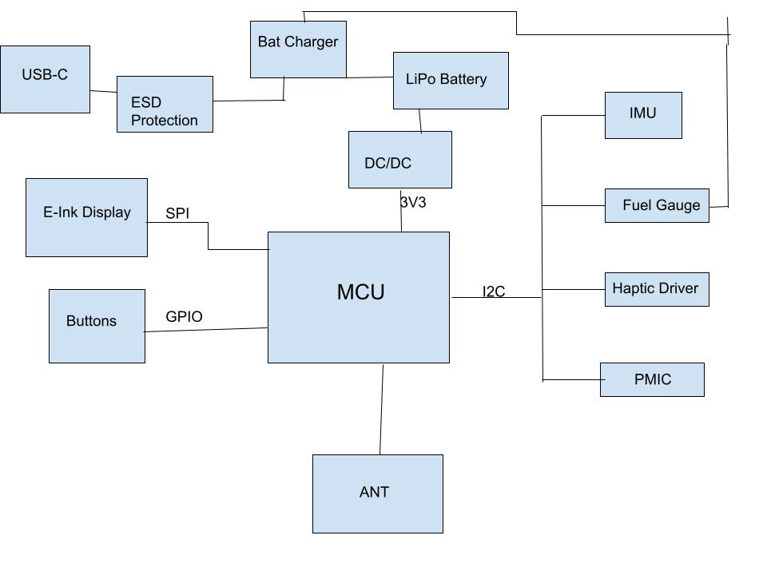
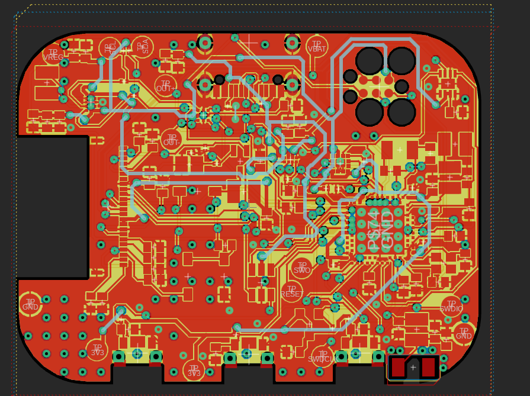
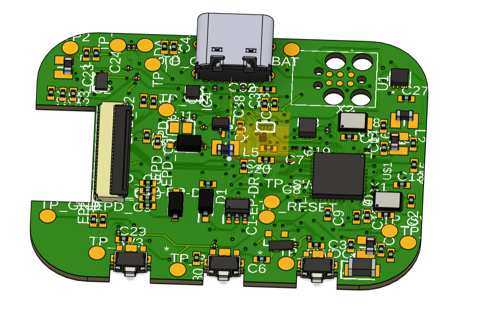
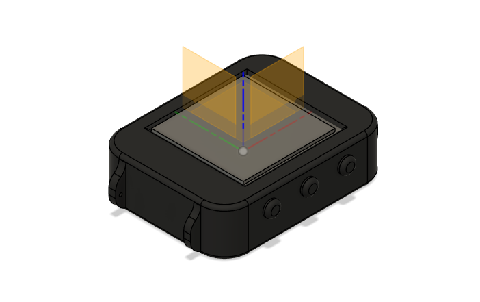

## 1. Schema bloc

## 2. Descrierea functionalitatii hardware

Sistemul este proiectat in jurul microcontrolerului nRF52840, punand accent pe conectivitate stabila si conservarea energiei, utilizand o tehnologie de afisare E-Paper care permite vizibilitate excelenta in lumina solara cu un consum de curent extrem de mic in starea statica.

### 2.1. Nucleul Sistemului (MCU)
* **Microcontroler:** Nordic nRF52840.
* **Comunicatie:** Gestioneaza functionalitatile Bluetooth si perifericele prin I2C si SPI.
* **Radio:** Semnalul trece printr-o retea de filtrare catre o antena ceramica de 2.4GHz. Sub antena, PCB-ul este decupat pentru a nu bloca semnalul.

### 2.2. Management Energie
* **Incarcare:** Chip-ul BQ25180 gestioneaza incarcarea bateriei LiPo prin mufa USB-C.
* **Monitorizare:** MAX17048 masoara constant nivelul bateriei si transmite datele prin I2C.
* **Regulator:** RT6160A (Buck-Boost) asigura o tensiune constanta de 3.3V, chiar si cand bateria se descarca.

### 2.3. Afisaj si Feedback
* **Ecran E-Paper:** Conectat prin interfata SPI pentru consum minim (consuma energie doar cand schimba imaginea).
* **Circuit Drive:** Include tranzistori si diode pentru a genera tensiunile necesare refresh-ului ecranului.
* **Vibratii:** Driver-ul DRV2605 controleaza motorul haptic, oferind alerte tactile utilizatorului.

### 2.4. Senzori si Protectie
* **Miscare:** Senzorul BMA423 (IMU) este folosit pentru pedometru si detectarea gestului de ridicare a mainii.
* **Protectie USB:** Chip-ul USBLC6-2 protejeaza placa impotriva descarcarilor electrostatice de pe portul USB.

### 2.5. Calcule de consum (estimativ)
* **Sleep Mode:** Consumul sistemului este de aproximativ 2-5 uA (nRF52840 + IMU in low power).
I_sleep = MCU_off + IMU_low + FuelGauge + DC/DC = 1.5 + 7 + 23 + 2 = ~33.5 uA
* **Active Mode:** In timpul transferului de date sau refresh-ului ecranului, consumul poate urca la 5-12 mA.
I_active = MCU_active + IMU_active + EPD_refresh + Haptic = ~10mAh
* **Autonomie:** 
Presupunand ca dintr-o ora, ceasul e activ 2 minute si in standby 58 de minute:
I_mediu = ( (I_active * 2 min) + (I_sleep * 58 min)) / 60 min = ~365 uA

Deci, autonomia e capacitatea_bateriei / I_mediu = 100mAh / 365uA = ~274 ore

## 3. Alocarea Pinilor nRF52840 (Pin Mapping)

Configuratia pinilor a fost aleasa pentru a optimiza rutarea pe PCB si pentru a respecta cerintele perifericelor. Toti pinii sunt configurati in firmware conform tabelului:

| Functie / Periferic | Semnal (Net) | Pin MCU | Explicatie |
| :--- | :--- | :--- | :--- |
| **I2C Bus (SCL)** | `I2C_SCL` | **P0.27** | Bus comun: IMU, Fuel Gauge, Haptic, PMIC. |
| **I2C Bus (SDA)** | `I2C_SDA` | **P0.26** | Bus comun: IMU, Fuel Gauge, Haptic, PMIC. |
| **SPI (SCK)** | `EPD_SCK` | **P0.31** | Ceas pentru transfer date catre ecran. |
| **SPI (MOSI)** | `EPD_MOSI` | **P0.29** | Date imagini catre ecran. |
| **EPD Control** | `EPD_BUSY` | **P0.05** | Indica daca ecranul este ocupat. |
| **EPD Control** | `EPD_RST` | **P0.06** | Reset hardware pentru ecran. |
| **EPD Control** | `EPD_DC` | **P0.08** | Selectie Date sau Comenzi (Data/Command). |
| **Butoane** | `SW_UP` | **P0.11** | Buton SUS (navigare). |
| **Butoane** | `SW_ENT` | **P0.12** | Buton SELECT (confirmare). |
| **Butoane** | `SW_DN` | **P0.14** | Buton JOS (navigare). |
| **Haptic Feedback**| `EN_HAPTIC` | **P0.17** | Activare driver vibratii. |
| **Senzor IMU** | `IMU_INT1` | **P0.19** | Intrerupere pentru detectare miscare. |
| **Debug/Prog** | `SWDIO` | `SWDIO` | Programare si depanare. |
| **Debug/Prog** | `SWCLK` | `SWCLK` | Ceas programare. |

---

## 4. Detalii de Design (Design Log)

### 4.1. Implementare PCB
* **Antena RF:** Plasata pe margine, cu zona de sub ea libera (fara cupru) pentru semnal Bluetooth bun.
* **Grosime:** PCB-ul are 1.0mm grosime pentru a incapea in carcasa InkTime si am ales ca rutarea sa fie pe 4 layere: unul de GND, unul de Power, unul de top si unul de bottom.
* **Filtrare:** Condensatorii de 100nF sunt pusi cat mai aproape de pinii de alimentare ai chip-urilor.
* **Trasee:** Puterea are latime de 0.3mm, iar semnalele de date 0.15mm.
* **Abordare:** Initial, am incercat sa fac autorutare, dar nu a functionat, asa ca apoi am aranjat componentele pe placa pentru a fi cat mai putine fire intre pini indepartati, apoi am rutat semnalele care nu sunt de putere, apoi pe cele de putere, iar la final am pus polygon pour si am tras si ultimele fire de GND ramase.

### 4.2. Carcasa si Erori
* **Aliniere:** Butoanele si mufa USB-C sunt puse exact unde sunt gaurile in carcasa data.
* **Erori permise:** Erorile de tip "Dimension" de la USB si butoane sunt ignorate conform cerintelor proiectului. 
* **Erori ERC:** Singurele erori care au ramas sunt cele legate de pinii de care nu am legat nimic.
* **Erori DRC:** Erorile pe care le-am admis sunt cele cauzate de fire care trec printre alti pini ai microcontrollerului (asta nu se poate evita) sau viasuri care sunt prea apropiate din acelasi motiv.

## 5. Tabel BOM (Bill of Materials)

Mai jos sunt prezentate componentele principale necesare pentru asamblarea ceasului InkTime. Codurile de produs sunt optimizate pentru serviciul de asamblare JLC PCB.

| Designator | Componenta | Descriere / Parametri | Link Achizitie | Datasheet |
| :--- | :--- | :--- | :--- | :--- |
| U1 | **nRF52840** | MCU Bluetooth 5.4, ARM Cortex-M4F | [Link JLC](https://jlcpcb.com/partdetail/NordicSemicon-NRF52840_QIAAR/C190794) | [Datasheet](https://www.lcsc.com/datasheet/lcsc_datasheet_2304140030_Nordic-Semicon-NRF52840-QIAA-R_C190794.pdf) |
| U2 | **BQ25180YBGR** | IC Incarcare Baterie LiPo (I2C) | [Link JLC](https://jlcpcb.com/partdetail/TexasInstruments-BQ25180YBGR/C3682423) | [Datasheet](https://www.ti.com/cn/lit/gpn/bq25180) |
| U3 | **MAX17048G+T10**| Fuel Gauge (Monitorizare baterie) | [Link JLC](https://jlcpcb.com/partdetail/2777647-MAX17048GT10/C2682616) | [Datasheet](https://www.lcsc.com/datasheet/lcsc_datasheet_2410121738_Analog-Devices-Inc--Maxim-Integrated-MAX17048G-T10_C2682616.pdf) |
| IC1 | **RT6160AWSC** | Regulator Buck-Boost 3.3V | [Link JLC](https://jlcpcb.com/partdetail/RichtekTech-RT6160AWSC/C7065276) | [Datasheet](https://wmsc.lcsc.com/wmsc/upload/file/pdf/v2/lcsc/2312271436_Richtek-Tech-RT6160AWSC_C7065276.pdf) |
| IC2 | **BMA423** | Accelerometru 3 axe (IMU) | [Link JLC](https://jlcpcb.com/partdetail/BoschSensortec-BMA423/C189517) | [Datasheet](https://www.lcsc.com/datasheet/lcsc_datasheet_1810010040_Bosch-Sensortec-BMA423_C189517.pdf) |
| IC3 | **DRV2605YZFR** | Driver Motor Haptic (LRA/ERM) | [Link JLC](https://jlcpcb.com/partdetail/TexasInstruments-DRV2605YZFR/C81079) | [Datasheet](https://jlcpcb.com/partdetail/TexasInstruments-DRV2605YZFR/C81079) |
| ANT1 | **2450AT18B100E**| Antena Ceramica 2.4GHz | [Link JLC](https://jlcpcb.com/partdetail/JohansonDielectrics-2450AT18B100E/C2917717) | [Datasheet](https://www.lcsc.com/datasheet/lcsc_datasheet_2404021210_Johanson-Dielectrics-2450AT18B100E_C2917717.pdf) |
| J1 | **KH-TYPE-C-16P** | Conector USB Type-C 16 pini | [Link JLC](https://jlcpcb.com/partdetail/Shenzhen_KinghelmElec-KH_TYPE_C16P/C709357) | [Datasheet](https://jlcpcb.com/partdetail/Shenzhen_KinghelmElec-KH_TYPE_C16P/C709357) |
| J2 | **503480-2400** | Conector FPC 24 pini (E-Paper) | [Link JLC](https://jlcpcb.com/parts/componentSearch?searchTxt=503480-2400) | [Datasheet](https://www.molex.com/content/dam/molex/molex-dot-com/products/automated/en-us/salesdrawingpdf/503/503480/5034802400_sd.pdf?inline) |
| C_dec | **Condensator 100nF** | 0201, X5R, 6.3V (Decuplare generala) | [Link JLC](https://jlcpcb.com/partdetail/SamsungElectroMechanics-CL03A104KQ3NNNC/C1613) | [Datasheet](https://datasheet.lcsc.com/lcsc/1811141213_Samsung-Electro-Mechanics-CL03A104KQ3NNNC_C1613.pdf) |
| C_bulk | **Condensator 10uF** | 0402, X5R, 10V (Filtrare alimentare) | [Link JLC](https://jlcpcb.com/partdetail/MurataElectronics-GRM155R61A106ME11D/C155255) | [Datasheet](https://datasheet.lcsc.com/lcsc/1811011516_Murata-Electronics-GRM155R61A106ME11D_C155255.pdf) |
| R_pu | **Rezistenta 4.7k** | 0201, 1/20W (Pull-up I2C/Butoane) | [Link JLC](https://jlcpcb.com/partdetail/Yageo-RC0201JR074K7L/C13032) | [Datasheet](https://datasheet.lcsc.com/lcsc/1811021213_Yageo-RC0201JR-074K7L_C13032.pdf) |
| L_pwr | **Inductor 1.0uH** | 0805, 2.1A (Pentru RT6160A/Buck-Boost) | [Link JLC](https://jlcpcb.com/partdetail/Sunlord-MWSA0503S1R0MT/C2915000) | [Datasheet](https://datasheet.lcsc.com/lcsc/2203151500_Sunlord-MWSA0503S-1R0MT_C2915000.pdf) |
| X_32k | **Cristal 32.768kHz** | 1.6x1.0mm, 9pF (Pentru Sleep Mode nRF) | [Link JLC](https://jlcpcb.com/partdetail/YangzhouYangjieElectronic-FC1610AN32_7680KA_A/C147814) | [Datasheet](https://datasheet.lcsc.com/lcsc/1811141221_Epson-FC-1610-32-7680KA-A3_C147814.pdf) |
| D_esd | **USBLC6-2P6** | Protectie ESD USB (SOT-666) | [Link JLC](https://jlcpcb.com/partdetail/STMicroelectronics-USBLC62P6/C7519) | [Datasheet](https://www.st.com/resource/en/datasheet/usblc6-2.pdf) |
